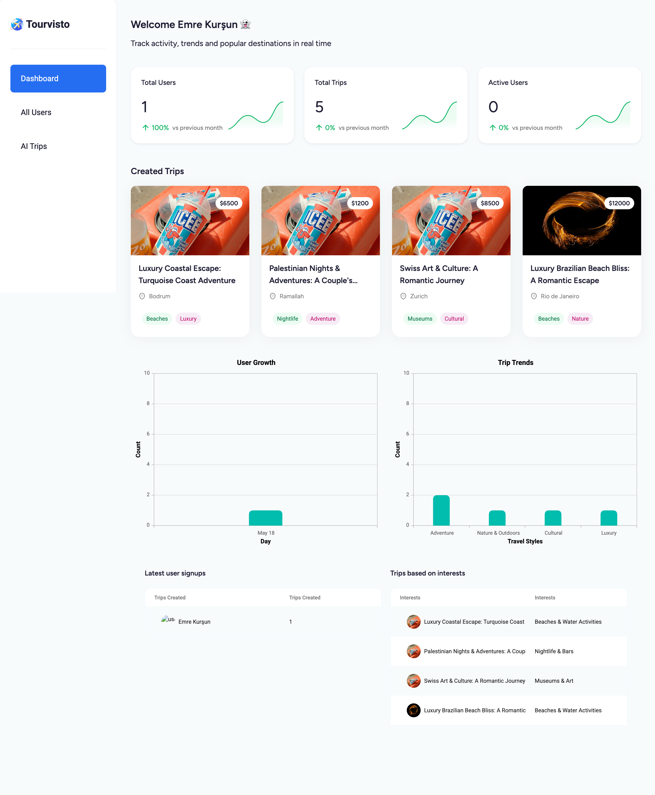
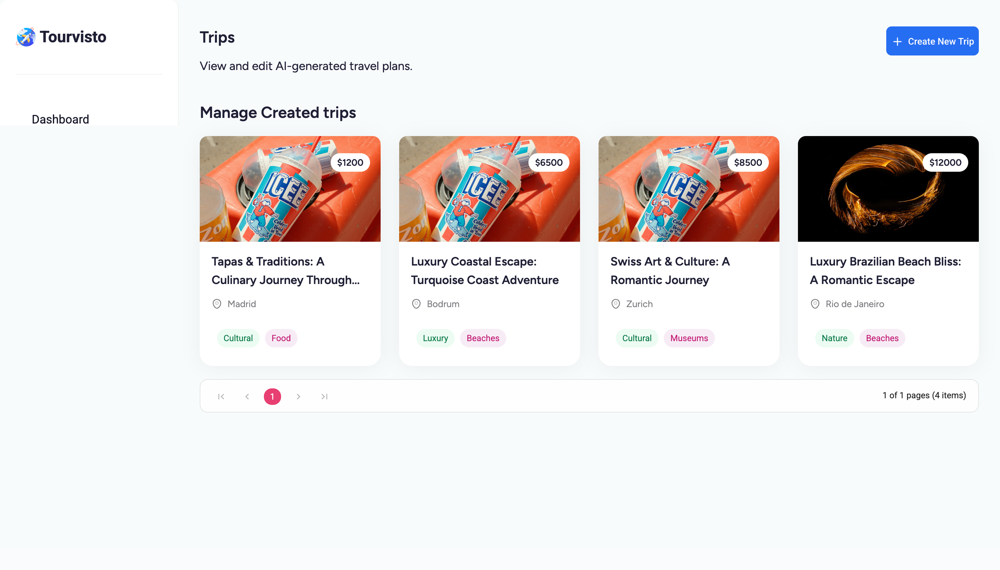
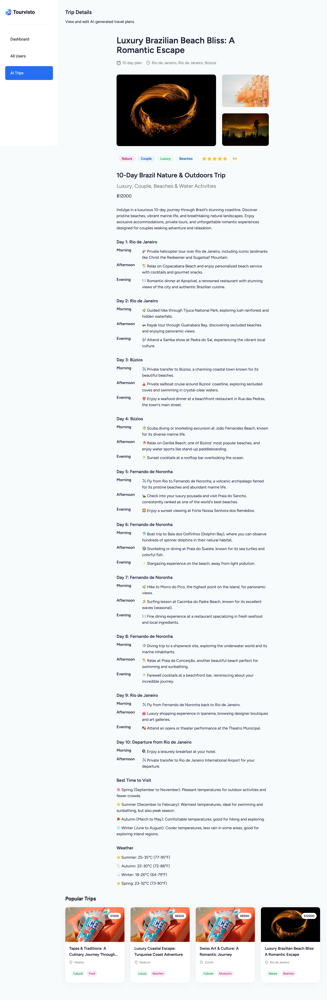
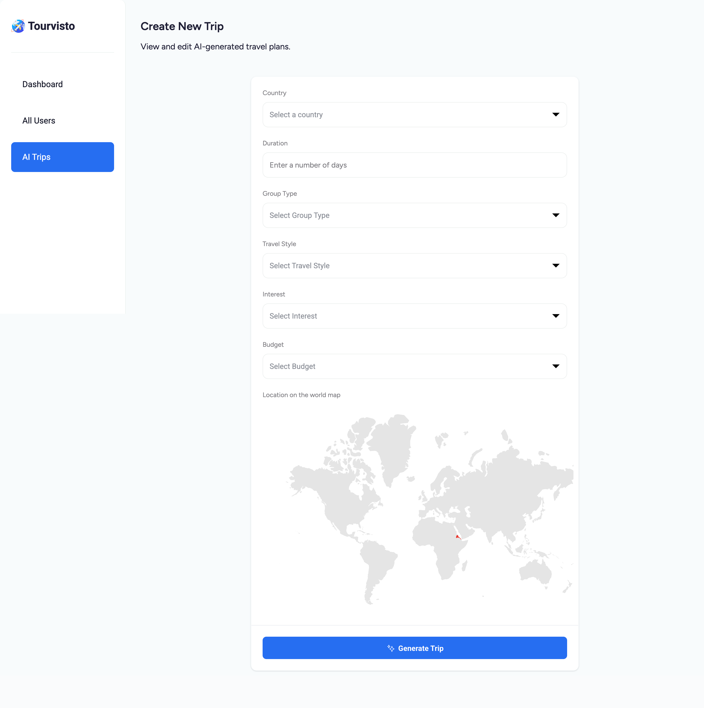

# TravelAgency

**TravelAgency** is a modern, full-stack web application that leverages AI to generate personalized travel itineraries and integrates with Appwrite and Unsplash APIs to store data and fetch images.

---

## Table of Contents

1. [Features](#features)
2. [Tech Stack](#tech-stack)
3. [Getting Started](#getting-started)
   - [Prerequisites](#prerequisites)
   - [Installation](#installation)
   - [Environment Variables](#environment-variables)
   - [Running the App](#running-the-app)
4. [Project Structure](#project-structure)
5. [API Routes](#api-routes)
6. [Usage](#usage)
7. [Screenshots](#screenshots)
8. [Available Scripts](#available-scripts)
9. [Deployment](#deployment)
10. [Contributing](#contributing)
11. [License](#license)

---

## Features

- **AI-Powered Itineraries**: Uses Google Gemini (via `@google/generative-ai`) to generate day-by-day travel plans.
- **Image Integration**: Fetches relevant images from Unsplash based on destination, interests, and travel style.
- **Appwrite Backend**: Stores user and trip data in an Appwrite database and handles authentication.
- **Admin Dashboard**: React-based dashboard with charts and grids (Syncfusion) to monitor users and trips statistics.
- **Server-Side Routing**: Built on React Router v7 with SSR support and data loaders for fast, SEO-friendly pages.
- **Tailwind CSS**: Utility-first styling for rapid UI development.

---

## Tech Stack

- Frontend: React 19, React Router v7, Tailwind CSS
- Backend: Appwrite (Database & Authentication)
- AI & APIs: Google Generative AI (Gemini), Unsplash API
- Charts & UI Components: Syncfusion React components
- Build & Tooling: Vite, TypeScript, Node.js

---

## Getting Started

### Prerequisites

- Node.js v18+ and npm installed
- Appwrite server instance with Database and Authentication services
- Unsplash developer account with an access key
- Google Cloud project with Gemini API key

### Installation

1. Clone the repository:
   ```bash
   git clone https://github.com/yourusername/TravelAgency.git
   cd TravelAgency
   ```
2. Install dependencies:
   ```bash
   npm install
   ```

### Environment Variables

Create a file named `.env.local` in the project root and add the following:

```bash
# Appwrite configuration
VITE_APPWRITE_ENDPOINT=<your-appwrite-endpoint>
VITE_APPWRITE_PROJECT=<your-appwrite-project-id>
VITE_APPWRITE_DATABASE_ID=<your-database-id>
VITE_APPWRITE_TRIPS_COLLECTION_ID=<your-trips-collection-id>

# Unsplash API
UNSPLASH_ACCESS_KEY=<your-unsplash-access-key>

# Google Gemini
GEMINI_API_KEY=<your-gemini-api-key>
```

### Running the App

```bash
# Start the development server
npm run dev
```

Open your browser at `http://localhost:5173` to view the application.

---

## Project Structure

```plaintext
TravelAgency/
├── app/
│   ├── routes/            # React Router server-side routes
│   ├── app.css            # Global styles
│   └── root.tsx           # Application root layout
├── components/            # Reusable React UI components
├── lib/utils.ts           # Utility functions (parsing, formatting)
├── appwrite/              # Appwrite client and API wrappers
├── constants/             # Shared constants (chart config, maps)
├── public/                # Static assets (images, icons)
├── README.md              # This file
├── package.json
└── vite.config.ts         # Vite configuration
```

---

## API Routes

- **POST** `/api/create-trip` - Generates a trip itinerary using AI and stores it in Appwrite.

  Request Body:

  ```json
  {
    "country": "USA",
    "numberOfDays": 5,
    "travelStyle": "Luxury",
    "interests": "Nature, Museums",
    "budget": "Moderate",
    "groupType": "Family",
    "userId": "abc123"
  }
  ```

  Response:

  ```json
  { "id": "tripDocId" }
  ```

---

## Usage

- **Admin Dashboard** (`/dashboard`): View stats, latest trips, user growth charts, and manage users.
- **Trips List** (`/trips`): Browse saved trips with summary cards.
- **Trip Details** (`/trips/:tripId`): View full itinerary, images, and trip metadata.
- **Create Trip** (`/trips/create`): Form-based interface to generate a new trip using AI.

---

## Screenshots

1. **Dashboard**

   
   <br>

2. **Trips List**

   
   <br>

3. **Trip Detail**

   
   <br>

4. **Create Trip Form**
   

---

## Available Scripts

- `npm run dev` - Start dev server with HMR
- `npm run build` - Build for production
- `npm run start` - Serve the production build
- `npm run typecheck` - Generate route types and run TypeScript check

---

## Deployment

- **Vercel / Netlify**: Connect repo, configure environment variables, and deploy.
- **Docker**:
  ```bash
  docker build -t travelagency .
  docker run -p 3000:3000 --env-file .env.local travelagency
  ```
